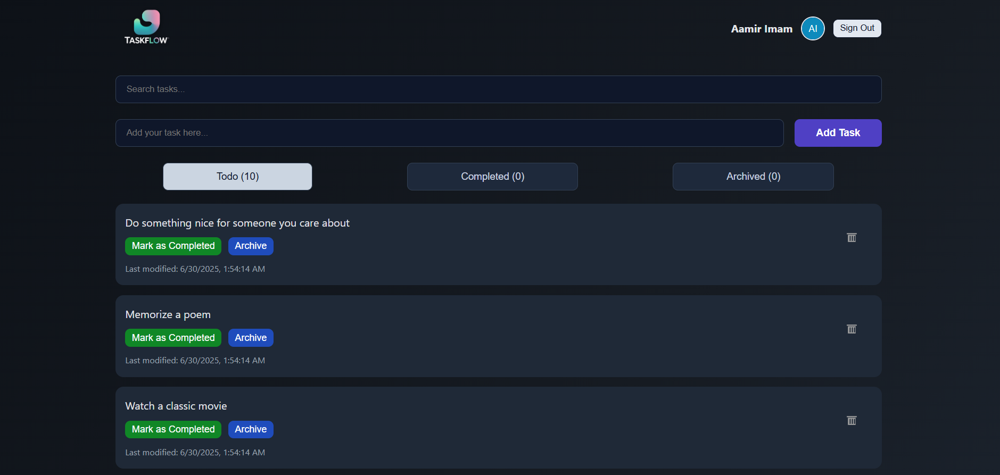
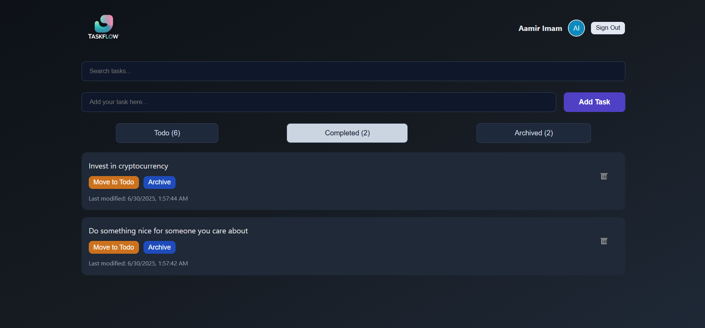
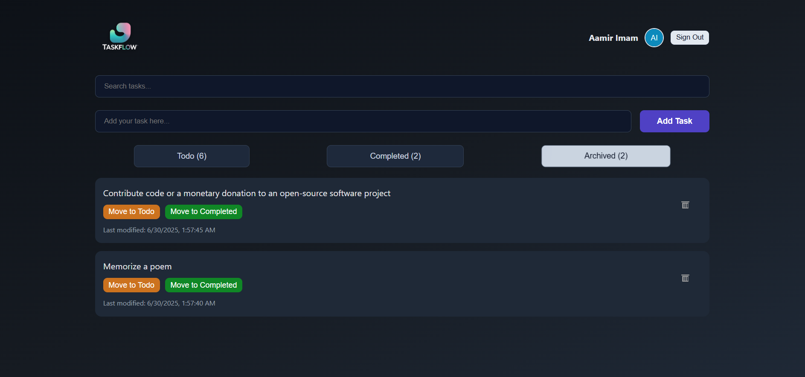

# TaskFlow

**TaskFlow** is a modern and minimalistic front-end web application designed to help users manage their daily tasks seamlessly. 
It provides an intuitive and user-friendly interface with modular design, making it a great starting point for task-based web applications.
It also includes features like login, task dashboard, and a clean UI layout.

---
## 📸 Preview

### > Age Restricted Registration Form: -

### > Existing User Signin Form: -

### > Todo Tasks List Focused Card: -

### > Completed Tasks List Focused Card: -

### > Archived Tasks List Focused Task Card: -



---

## 🚀 Features

- 📝 Task creation and management
- 🔐 User login interface
- 💻 Responsive UI using HTML, CSS, and JavaScript
- 📂 Organized asset and code structure

---

## 🛠️ Tech Stack

| Layer          | Technology         |
|----------------|--------------------|
| Structure      | HTML5              |
| Styling        | CSS3               |
| Interactivity  | Vanilla JavaScript |
| Hosting        | Netlify            |

---

## 📁 Directory Structure

```
TaskFlow/
├── app.html              # Main app/dashboard page
├── index.html            # Landing page
├── login.html            # Login page
├── assets/               # Static images and icons
│   ├── login.png
│   ├── logo.png
│   └── logo1.png
├── js/                   # JavaScript functionality
│   ├── app.js
│   ├── index.js
│   └── login.js
└── style/                # CSS styles
    ├── app.css
    ├── index.css
```

---


## 🧑‍💻 Getting Started

To run this project locally:

1. **Clone the repository**
   ```bash
   git clone https://github.com/your-username/TaskFlow.git
   ```

2. **Navigate to the project directory**
   ```bash
   cd TaskFlow
   ```

3. **Open `index.html` in your browser**
   - You can open it directly or use a live server extension in VS Code.


---
## Live Demo

Check out the app live at: https://taskflow07.netlify.app/
